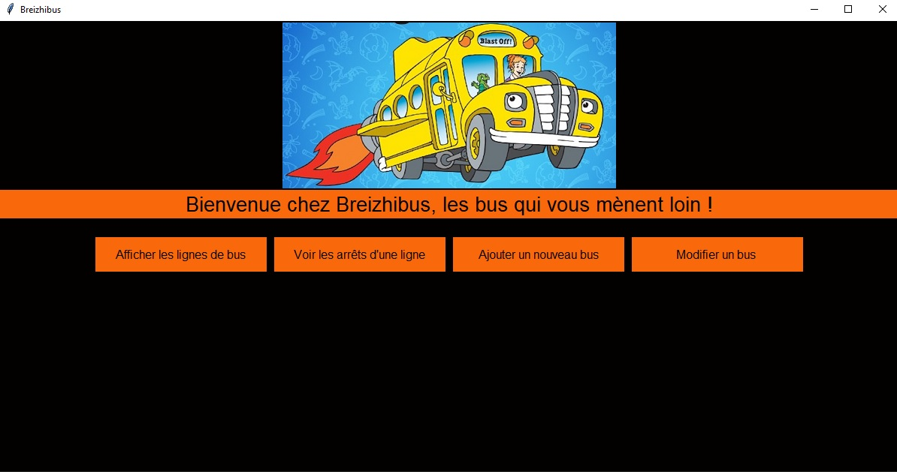
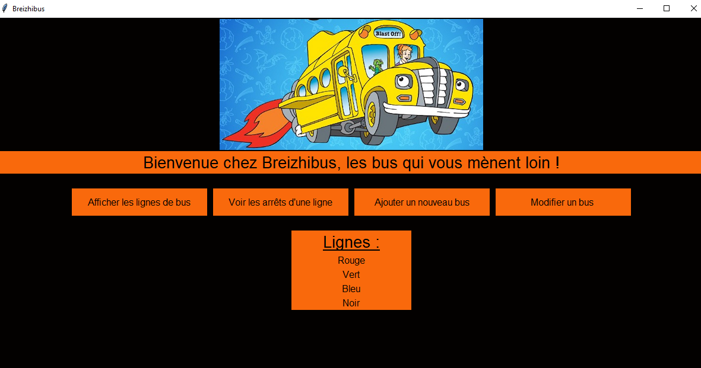
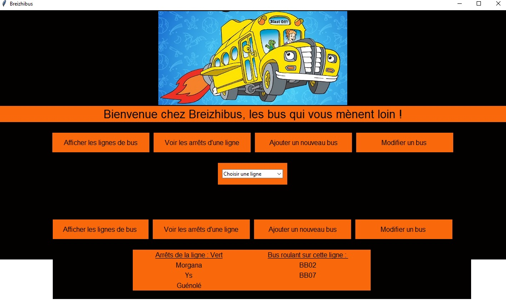
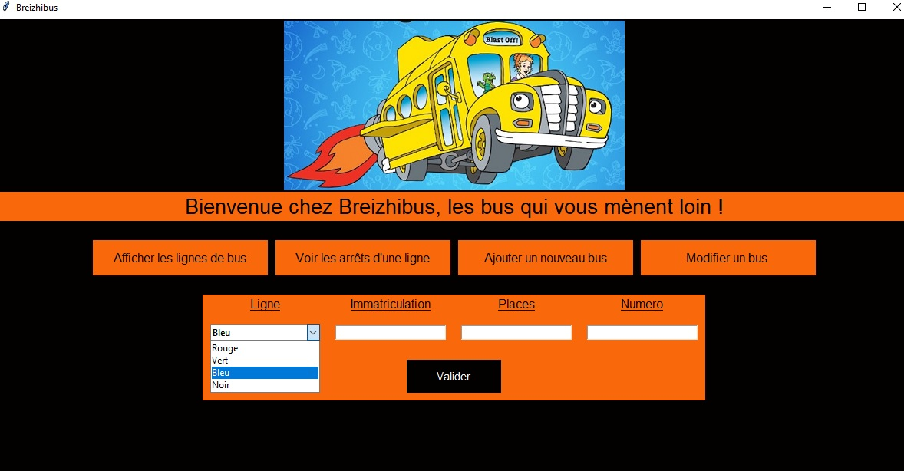

# Breizhibus
Préparer une base de données et écrire un code qui permet à Breizhibus de gérer ses lignes de bus. projet individuel, Aude Pertron
L'application se lance avec le fichier main_breizhibus.py
le fichier breizhi.pi lance le permier jet (basé sur le premier brief) en version console. Il est fonctionnel.

## Fonctionnement de l'application

L'interface possède 4 boutons.

### Afficher Lignes

### Arrêts

### Ajouter bus

### et ainsi de suite

## Les choix techniques

Plusieurs fichiers fonction, un fichier connexion qui gère les connexions et requêtes à la BDD, un fichier interface qui gère l'interface graphique.

La programmation est réalisé principalement en classes/méthodes, je trouve ce système plus performant.
L'interface graphique est réalisée avec tkinter, que je trouve (avec un peu de pratique) relativement facile à utiliser.

## Les difficultés rencontrées

Pas de difficultés sur toute la partie base de données, par contre plus de temps passé sur l'interface numérique, et particulièrement la gestion des boutons. Je ne me suis pas inspirée d'un tuto en particulier, mais ai plutôt procédé par essai et erreur.
J'ai passé un peu de temps à réussir l'affichage du logo, chose que j'avais déjà faite par le passé mais pas en programmation objet. En l'occurece, je n'avais pas utilisé de `self.` en début d'instruction. (Résolu avec l'aide de Thomas)

